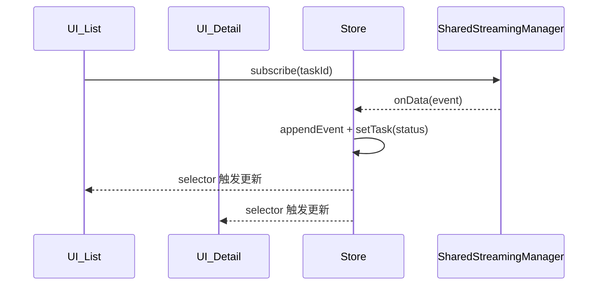

# 🦙 Llama UI – Workflow Task Suite （设计完成稿）

本文档描述 **最终确定** 的组件与 Hook 设计，以及对应的数据存储方案。  
已按以下前提定稿：

* 采用 **多实例 Store**（每个业务域独立 Zustand Store）  
* **不再暴露 Context / Provider**；用户直接使用 Hook 与组件  
* `SharedStreamingManager` 继续负责所有流连接与去重

---

## 1. 数据模型

### 1.1 类型

```ts
type RunStatus = 'idle' | 'running' | 'complete' | 'error';

interface WorkflowTaskSummary {
  task_id:   string;
  session_id:string;
  service_id:string;   // workflow 名称
  input:     string;   // 任务输入
  deployment:string;   // 部署名
  status:    RunStatus;
  createdAt: Date;
  updatedAt: Date;
}

interface WorkflowEvent {
  // 事件结构（由后端决定）
}

interface WorkflowProgressState {
  current: number;
  total:   number;
  status:  RunStatus;
}
```

### 1.2 Task Store（`taskStore.ts`）

```ts
export const useTaskStore = create<{
  /* 状态 */
  tasks:  Record<string, WorkflowTaskSummary>;
  events: Record<string, WorkflowEvent[]>;

  /* 动作 */
  setTask(task: WorkflowTaskSummary): void;             // insert / update
  appendEvent(id: string, e: WorkflowEvent): void;      // 追加事件
  clearEvents(id: string): void;                        // 清空事件
  clearCompleted(): void;                               // 本地移除完结任务
}>()(
  persist(
    (set, get) => ({
      tasks:  {},
      events: {},

      setTask: (task) =>
        set({ tasks: { ...get().tasks, [task.task_id]: task } }),

      appendEvent: (id, e) =>
        set({
          events: {
            ...get().events,
            [id]: [...(get().events[id] ?? []), e],
          },
        }),

      clearEvents: (id) =>
        set({ events: { ...get().events, [id]: [] } }),

      clearCompleted: () =>
        set({
          tasks: Object.fromEntries(
            Object.entries(get().tasks).filter(
              ([, t]) => t.status !== 'complete' && t.status !== 'error'
            )
          ),
        }),
    }),
    { name: 'llama-task' } // localStorage key
  )
);
```

* **持久化**：仅 `tasks` 持久化；`events` 运行期缓存  
* **单例**：模块顶层创建即可，无额外初始化代码  
* **清理流**：在 `window.beforeunload` 监听中执行  
  `streamingManager.closeAllStreams()`（由库内部自动注册）

---

## 2. Hooks

| Hook | 返回值 | 核心逻辑 |
|------|--------|----------|
| `useWorkflowTaskCreate()` | `{ createTask, isCreating, error }` | 调后端创建 → `store.setTask`（**不启动流**） |
| `useWorkflowTaskList()`   | `{ tasks[], clearCompleted }` | 订阅 `store.tasks`<br>对 `running` 任务调用 `streamingManager.subscribe`；事件到达时写入 `store.appendEvent / setTask` |
| `useWorkflowTask(taskId)` | `{ task, events[], isStreaming, stopStreaming, clearEvents }` | 首次 & taskId 变化时 `subscribe`，卸载 `stopStreaming`；`isStreaming` = `streamingManager.isStreamActive(key)` |
| `useWorkflowProgress()`   | `{ current, total, status }` | 从 `store.tasks` 计算完成数与整体状态 |

---

## 3. UI 组件

| 组件 | 依赖 Hook | 主要 Props | 功能 |
|------|-----------|-----------|------|
| `WorkflowTaskList`   | `useWorkflowTaskList` | `deployment?` `className?` | 列表渲染 + “Clear Completed” 按钮 |
| `WorkflowTaskDetail` | `useWorkflowTask`    | `taskId` `autoStream=true` `className?` | 时间线展示事件；根据 `autoStream` 控制流 |
| `WorkflowProgressBar`| `useWorkflowProgress`| `className?`               | 进度条 + 图标（running→processing, complete→completed, error→failed） |
| `WorkflowTrigger`    | `useWorkflowTaskCreate` | `deployment` `workflow?` `className?` | 触发新任务（上传/按钮） |

> 所有组件均导出自包根目录，使用者无需关心内部 Store 或 Streaming。

---

## 4. 内部与流协作流程



* 多个订阅同一 `taskId` 时，`StreamMgr` 自动复用连接  
* `Store` 只存**视图数据**，不维护连接状态  

---

## 5. 对库使用者的体验

```tsx
import {
  useWorkflowTaskList,
  useWorkflowTask,
  useWorkflowTaskCreate,
  useWorkflowProgress,
  WorkflowTaskList,
  WorkflowTaskDetail,
  WorkflowProgressBar,
  WorkflowTrigger
} from '@llamaindex/ui';

// ❌ 无需 Provider
// ✅ 直接用 Hook / 组件
```

---

## 6. 版本演进与新域扩展

* 每个新业务域（如文件上传）自建独立 `uploadStore.ts` + Hooks + 组件  
* 共用 `SharedStreamingManager`，互不干扰  
* 若未来需要跨域协作，可在相应 Hook 中读取两个 Store 并编排逻辑

---

**至此，组件与 Hook 的设计方案确定完毕，后续可按此实现。**